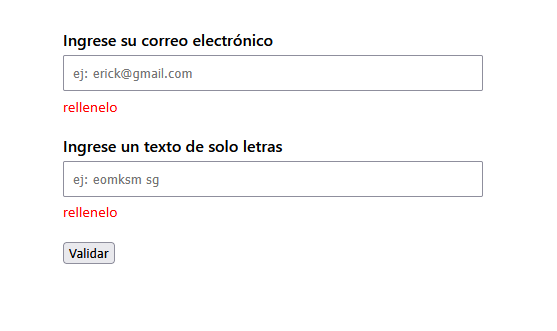
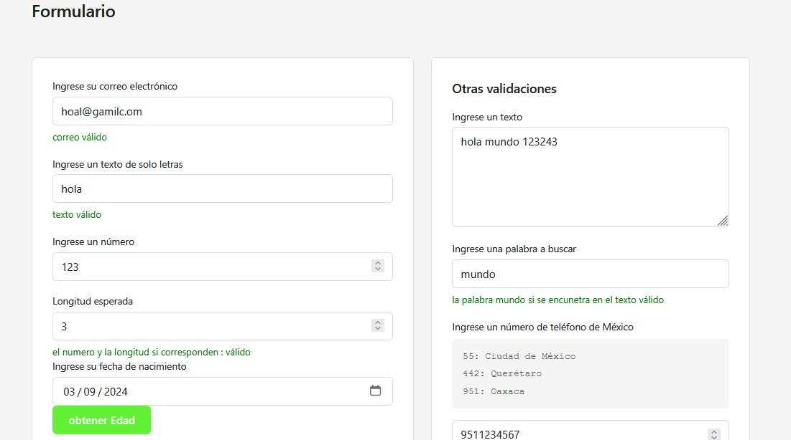
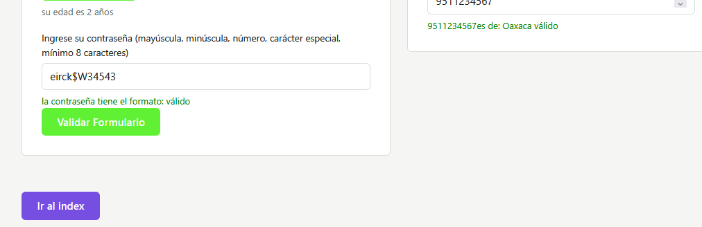

# utileria2.js
librería JS funcional (sin frameworks, sin componentes visuales) que usarán en su formulario, modal y login.html


# utileria_erick.js
libreria de javascript


Actividad 2 de la materia Progrmacion web 
Alumno: Santiago Ramirez Erick Omar
Institución: Instituto tecnologico de oaxaca
Carrera: Ingenieria en sistemas computacionales 

esta catividad busca aprender a crear librerias de js, para Una solución ligera en JavaScript nativo diseñada para facilitar la implementacion de validaciones de uso continuo para el ahorro de tiempo y codigo en formularios web


# como usarlo >> instalacion 

para usar las funciones de la libreria unicamnte debes poner el enlace del codigo que son :

```
https://cdn.jsdelivr.net/gh/ErickOmar4/utileria2.js@main/js/utileria.js
```
o utileria.min.js
```
 https://cdn.jsdelivr.net/gh/ErickOmar4/utileria2.js@main/js/utileria.min.js
```

y para ello se implementa directamente en el html en la seccion de la etiqueta head usando una etiqueta script, ejemplo de implementacion;

```
<!DOCTYPE html>
<html lang="en">
<head>
    <meta charset="UTF-8">
    <meta name="viewport" content="width=device-width, initial-scale=1.0">
    <script src="https://cdn.jsdelivr.net/gh/ErickOmar4/utileria-js@main/utileria.js"></script>
    <title>Document</title>
</head>
<body>
    
</body>
</html>
```

con la etiqueta ya puedes usar los metodos que existen la libreria desde tu poryecto sin tener que descargar nada

ejemplo de la a¿plicasion para validar un correo electrónico o una entrada de solo letras

```
<!DOCTYPE html>
<html lang="es">
<head>
    <meta charset="UTF-8">
    <meta name="viewport" content="width=device-width, initial-scale=1.0">
    <title>Proyecto externo usando utileria.js</title>

    <script src="https://cdn.jsdelivr.net/gh/ErickOmar4/utileria-js@main/utileria.js"></script>

    <style>
        body { font-family: system-ui, sans-serif; max-width: 420px; margin: 3rem auto; }
        label { display: block; font-weight: 600; margin-bottom: 0.3rem; }
        input, textarea { width: 100%; padding: 0.5rem; margin-bottom: 0.3rem; box-sizing: border-box; }
        p { margin: 0 0 1.2rem; font-size: 0.9rem; }
    </style>
</head>
<body>

    <label for="correo">Ingrese su correo electrónico</label>
    <input type="email" id="correo" placeholder="ej: erick@gmail.com">
    <p id="r_email"></p>

    <label for="texto">Ingrese un texto de solo letras</label>
    <input type="text" id="texto" placeholder="ej: eomksm sg">
    <p id="r_texto"></p>

    <button type="button" onclick="validarTodo()">Validar</button>

    <script>
        function validarTodo() {
            let correoElectronico = document.getElementById("correo").value;
            if (campoNoVacio("r_email", correoElectronico,"rellenelo")) {
                if (validarCorreo(correoElectronico)) {
                    entradaValida("r_email", "correo");
                } else {
                    entradaNo_valida("r_email", "correo");
                }
            }

            let textoLetras = document.getElementById("texto").value;
            if (campoNoVacio("r_texto", textoLetras,"rellenelo")) {
                if (solo_letras(textoLetras)) {
                    entradaValida("r_texto", "texto");
                } else {
                    entradaNo_valida("r_texto", "texto");
                }
            }
        }
    </script>

</body>
</html>
```



en este repositorio se implementan todas la funciones de la libreria 


y da como resultado 


formulario parte 1

foorumalrio parte 2



## funciones

soloLetras 
entradas 
 * erick ----valido
 * pepe32 --falso 
Acepta letras con acentos, ñ y espacios este lo uso para el nombre
```
function soloLetras(l) {
    let letras = /^[A-Za-zÁÉÍÓÚáéíóúÑñ\s]+$/;
    return letras.test(l);
}

```
validaLongitud(numero, maxLongitud)
  ejemplos
  validaLongitud(12345, 5)  // true
  validaLongitud(123456, 5) // false porque son 6 numeros y se esperava 

```
function validarLongitud(n, lm) {
    return n.toString().length === lm;
}
```

calcularEdad(fechaNacimiento)
  Calcular la edad exacta en años a partir de la fecha de nacimiento 
   {string|Date} fechaNacimiento - Fecha de nacimiento
  calcularEdad('2000-01-15') // 26 
  calcularEdad('1990-06-30') // 36

```
function calcularEdad(fn) {
    let fechaNacimiento = new Date(fn);
    let fechaActual = new Date();

    let edad = fechaActual.getFullYear() - fechaNacimiento.getFullYear();
    let mes = fechaActual.getMonth() - fechaNacimiento.getMonth();

    if (mes < 0 || (mes === 0 && fechaActual.getDate() < fechaNacimiento.getDate())){
        edad--;
    }
    return edad;
}
```
# utileria completa

```
let mensaje_Vacio = "el campo esta vacio, ingrese lo que se pide";

function validarCorreo(c) {
    let correo = /^[^\s@]+@[^\s@]+\.[^\s@]+$/;
    return correo.test(c);
}

function solo_letras(palabra){
    let soloLetras =  /^[A-Za-zÁÉÍÓÚáéíóúÑñ\s]+$/;
    return soloLetras.test(palabra);
}

function validarLongitud(entrada,longitud){
    return entrada.toString().length === Number(longitud);
}

function calcularEdad(fechaNacimiento_e){
    let fechaNacimiento = new Date(fechaNacimiento_e);
    let fechaActual = new Date();

    let edad= fechaActual.getFullYear()- fechaNacimiento.getFullYear();
    let mes= fechaActual.getMonth() -fechaNacimiento.getMonth();

    if(mes < 0 || (mes === 0 && fechaActual.getDate()< fechaNacimiento.getDate())){
        edad--;
    }
    return edad;
}

function esMayorEdad(edad){
    return calcularEdad(edad)>=18;
}

function validarPassword(e_password){
    let password = /^(?=.*[a-z])(?=.*[A-Z])(?=.*\d)(?=.*[@$!%*?&.#_-])[A-Za-z\d@$!%*?&.#_-]{8,}$/;
    return password.test(e_password);
}

function validarCodigoPostal(e_cd_postal){
    let codigo_Postal = /^\d{5}$/;
}

function contarCaracteres(e_texto){
    return e_texto.length;
}

function contieneTexto(texto, palabra) {
    return texto.toLowerCase().includes(palabra.toLowerCase());
}

function solo_numeros(entrada) {
    let soloNumeros = /^\d+$/;
    return soloNumeros.test(Number(entrada));
}

function validarTelefono(e_telefono) {
   

    let telefono = e_telefono.toString();
    if (telefono.substring(0, 2) === "55") {
        return telefono+"es de: Ciudad de México (CDMX)";
    }

    if (telefono.substring(0, 3) === "442" || telefono.substring(0, 3) === "446") {
        return  telefono+"es de: Querétaro" ;
    }

    if (telefono.substring(0, 3) === "951") {
        return telefono+"es de: Oaxaca" ;
    }

    return "No se identifica la LADA del número";
}

function campoNoVacio(elemento,campoValido,mensaje_Vacio){
        if(campoValido !==""){
            return true;
        }else{
            document.getElementById(elemento).style.color = "red";
            document.getElementById(elemento).textContent = mensaje_Vacio;
            return false;
        }
        
    }

    function entradaValida(elemento,campoValido){
        document.getElementById(elemento).textContent = campoValido+" válido ";
        document.getElementById(elemento).style.color = "green";
    }
    function entradaNo_valida(elemento,campoValido){
        document.getElementById(elemento).textContent = campoValido+" no valido ";
        document.getElementById(elemento).style.color = "red";
    }
```